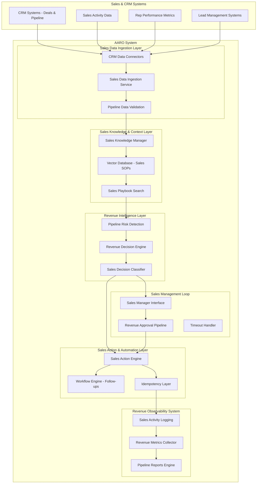

# Design Document: Autonomous AI Agent for Revenue Operations (AARO)

## Overview

The Autonomous AI Agent for Revenue Operations (AARO) is a production-ready AI system designed specifically for B2B SaaS and service companies to optimize revenue operations. The system employs a multi-agent architecture with distinct layers for sales data ingestion, sales knowledge management, revenue intelligence, and automated sales action execution.

The AARO continuously monitors sales pipeline data streams, applies intelligent pattern recognition to detect revenue leakage and execution gaps, and executes automated responses with appropriate human oversight. The system is built on modern software engineering principles with FastAPI as the backend framework, vector databases for sales knowledge storage, and workflow automation for sales action execution.

Key design principles include:
- **Revenue Focus**: Specialized for B2B SaaS sales pipeline optimization and revenue operations
- **Pipeline Intelligence**: Advanced pattern detection for stalled deals, missed follow-ups, and SOP deviations
- **Sales Automation**: Intelligent execution of follow-up tasks, deal updates, and manager alerts
- **Human Oversight**: Smart classification of revenue decisions requiring human approval vs. autonomous execution
- **Scalability**: API-first architecture with multi-tenant capabilities for growing sales organizations

## Architecture

The AARO follows a layered, agent-based architecture with four primary layers optimized for revenue operations:



### Layer Responsibilities

**Sales Data Ingestion Layer**: Responsible for collecting, normalizing, and validating sales pipeline data, deal progression, activity logs, and rep performance metrics from CRM systems.

**Sales Knowledge & Context Layer**: Implements RAG (Retrieval-Augmented Generation) capabilities using vector databases for storing and retrieving sales SOPs, playbooks, objection handling scripts, and successful deal patterns.

**Revenue Intelligence Layer**: Analyzes ingested sales data for pipeline risks, applies sales business rules, and classifies decisions based on revenue impact and risk levels.

**Sales Action & Automation Layer**: Executes approved sales decisions through various channels including follow-up task creation, deal updates, and manager notifications.

**Sales Management Loop**: Manages approval workflows for high-impact revenue decisions with timeout handling and escalation procedures.

**Revenue Observability System**: Provides comprehensive monitoring, logging, and revenue impact metrics across all sales operations.

## Components and Interfaces

### Data Ingestion Service

The Data Ingestion Service acts as the primary entry point for all external business data. It implements a plugin-based architecture for different data sources:

**Core Components:**
- **Connection Manager**: Handles authentication and connection pooling for external APIs
- **Data Normalizer**: Transforms incoming data into standardized internal formats
- **Validation Engine**: Ensures data quality and completeness before processing
- **Error Handler**: Manages connection failures, rate limiting, and retry logic

**Interfaces:**
```python
class DataConnector:
    def connect() -> ConnectionStatus
    def fetch_data(since: datetime) -> List[BusinessRecord]
    def validate_connection() -> bool
    def handle_error(error: Exception) -> ErrorResponse

class BusinessRecord:
    source: str
    record_type: str
    timestamp: datetime
    data: Dict[str, Any]
    metadata: Dict[str, Any]
```

### Knowledge Manager

The Knowledge Manager implements the RAG layer using vector databases for semantic search and retrieval:

**Core Components:**
- **Vector Store**: Manages embeddings for business documents, policies, and historical decisions
- **Embedding Service**: Generates vector representations of text content
- **Semantic Search**: Retrieves relevant context based on similarity matching
- **Version Control**: Tracks changes to business rules and policies

**Interfaces:**
```python
class KnowledgeManager:
    def store_document(content: str, metadata: Dict) -> DocumentId
    def search_similar(query: str, limit: int) -> List[SearchResult]
    def get_context(decision_type: str) -> BusinessContext
    def update_policy(policy_id: str, content: str) -> bool

class BusinessContext:
    relevant_policies: List[Policy]
    historical_decisions: List[Decision]
    business_rules: List[Rule]
    confidence_score: float
```

### Decision Engine

The Decision Engine analyzes data patterns and generates actionable recommendations:

**Core Components:**
- **Pattern Detector**: Identifies operational issues and opportunities using rule-based and ML approaches
- **Risk Assessor**: Evaluates potential impact and risk levels of detected patterns
- **Decision Classifier**: Categorizes decisions as auto-executable, approval-required, or insight-only
- **Recommendation Generator**: Creates structured recommendations with supporting evidence

**Interfaces:**
```python
class DecisionEngine:
    def analyze_patterns(data: List[BusinessRecord]) -> List[Pattern]
    def assess_risk(pattern: Pattern) -> RiskAssessment
    def classify_decision(pattern: Pattern, risk: RiskAssessment) -> DecisionClass
    def generate_recommendation(pattern: Pattern) -> Recommendation

class Recommendation:
    pattern_id: str
    decision_class: DecisionClass
    actions: List[Action]
    reasoning: str
    confidence: float
    estimated_impact: BusinessImpact
```

### Action Engine

The Action Engine executes approved decisions through various automation channels:

**Core Components:**
- **Workflow Orchestrator**: Manages complex multi-step actions
- **Integration Hub**: Handles connections to n8n, CRM systems, and other external services
- **Idempotency Manager**: Prevents duplicate action execution
- **Execution Monitor**: Tracks action status and handles failures

**Interfaces:**
```python
class ActionEngine:
    def execute_action(action: Action, context: ExecutionContext) -> ExecutionResult
    def schedule_action(action: Action, schedule: Schedule) -> ScheduleId
    def retry_failed_action(execution_id: str) -> ExecutionResult
    def get_execution_status(execution_id: str) -> ExecutionStatus

class ExecutionResult:
    execution_id: str
    status: ExecutionStatus
    outputs: Dict[str, Any]
    errors: List[ExecutionError]
    duration: timedelta
```

### Human Loop Interface

The Human Loop Interface manages approval workflows for high-risk decisions:

**Core Components:**
- **Approval Router**: Routes decisions to appropriate approvers based on business rules
- **Notification Service**: Sends approval requests via multiple channels
- **Timeout Manager**: Handles approval timeouts and escalation procedures
- **Decision Tracker**: Maintains audit trail of human decisions

**Interfaces:**
```python
class HumanLoopInterface:
    def request_approval(recommendation: Recommendation) -> ApprovalRequest
    def check_approval_status(request_id: str) -> ApprovalStatus
    def handle_timeout(request_id: str) -> TimeoutAction
    def record_decision(request_id: str, decision: HumanDecision) -> bool

class ApprovalRequest:
    request_id: str
    recommendation: Recommendation
    approver: User
    timeout: datetime
    escalation_rules: List[EscalationRule]
```

## Data Models

### Core Revenue Operations Entities

```python
@dataclass
class Lead:
    id: str
    source: str
    contact_info: ContactInfo
    status: LeadStatus
    last_contact: datetime
    follow_up_due: Optional[datetime]
    estimated_value: Optional[Decimal]
    assigned_rep: Optional[str]
    contact_attempts: int
    qualification_score: Optional[float]

@dataclass
class Deal:
    id: str
    lead_id: str
    stage: DealStage
    value: Decimal
    probability: float
    close_date: datetime
    last_activity: datetime
    activities: List[SalesActivity]
    assigned_rep: str
    days_in_current_stage: int
    next_action_due: Optional[datetime]

@dataclass
class SalesActivity:
    id: str
    deal_id: str
    activity_type: ActivityType  # call, email, meeting, demo
    completed_at: datetime
    rep_id: str
    outcome: Optional[str]
    next_action_scheduled: bool
    notes: Optional[str]

@dataclass
class SalesRep:
    id: str
    name: str
    quota: Decimal
    quota_attainment: float
    pipeline_value: Decimal
    activities_this_week: int
    avg_deal_velocity: float
    conversion_rates: Dict[str, float]
```

### Revenue Intelligence Models

```python
@dataclass
class PipelineRisk:
    risk_id: str
    risk_type: RiskType  # stalled_deal, missed_followup, sop_deviation
    detected_at: datetime
    confidence: float
    affected_deals: List[str]
    severity: Severity
    description: str
    recommended_actions: List[str]

@dataclass
class SalesAction:
    action_id: str
    action_type: SalesActionType  # create_task, update_deal, send_alert
    target_system: str
    parameters: Dict[str, Any]
    prerequisites: List[str]
    expected_outcome: str
    revenue_impact: Optional[Decimal]

@dataclass
class RevenueContext:
    deal_history: List[Deal]
    rep_performance: SalesRep
    similar_deals: List[Deal]
    sales_playbook_guidance: List[str]
    market_conditions: Optional[Dict[str, Any]]
```

### Revenue Observability Models

```python
@dataclass
class RevenueDecisionLog:
    decision_id: str
    timestamp: datetime
    pipeline_risk: PipelineRisk
    recommendation: SalesRecommendation
    human_decision: Optional[HumanDecision]
    execution_result: Optional[ExecutionResult]
    revenue_impact: Optional[RevenueImpact]

@dataclass
class RevenueImpact:
    pipeline_recovered: Optional[Decimal]
    velocity_improvement: Optional[float]
    deals_accelerated: int
    manual_work_saved: Optional[timedelta]
    conversion_rate_improvement: Optional[float]
```

## Correctness Properties

*A property is a characteristic or behavior that should hold true across all valid executions of a system—essentially, a formal statement about what the system should do. Properties serve as the bridge between human-readable specifications and machine-verifiable correctness guarantees.*

Based on the requirements analysis, the following correctness properties ensure the AARO system operates reliably and delivers expected revenue operations value:

### Sales Data Ingestion Properties

**Property 1: Comprehensive Sales Data Ingestion**
*For any* available CRM data source (deals, pipeline, activities, reps), when the Data_Ingestion_Layer attempts to retrieve data, it should successfully collect, normalize, and validate all accessible sales records from that source.
**Validates: Requirements 1.1, 1.2, 1.3, 1.4, 1.6**

**Property 2: Resilient Sales Data Processing**
*For any* sales data ingestion operation, if one data source fails, the system should continue processing all other available sources and log the failure details appropriately.
**Validates: Requirements 1.7**

**Property 3: Mock Sales Data Fallback**
*For any* CRM data source that becomes unavailable, the system should seamlessly switch to mock data sources that maintain realistic B2B SaaS sales scenarios without interrupting operations.
**Validates: Requirements 1.5**

### Sales Knowledge Management Properties

**Property 4: Sales Knowledge Storage and Retrieval**
*For any* sales playbook, SOP, or successful deal pattern stored in the Knowledge_Layer, it should be retrievable through semantic search with relevance ranking based on vector similarity.
**Validates: Requirements 2.1, 2.2, 2.3, 2.4**

**Property 5: Sales Knowledge Indexing and Versioning**
*For any* new or updated sales SOP added to the Knowledge_Layer, it should be immediately indexed for search and maintain complete version history for audit purposes.
**Validates: Requirements 2.5, 2.6**

### Revenue Intelligence Properties

**Property 6: Comprehensive Pipeline Risk Detection**
*For any* sales data containing pipeline risks (stalled deals, missed follow-ups, SOP deviations, inactive high-value opportunities), the Decision_Engine should detect the relevant patterns and classify them appropriately.
**Validates: Requirements 3.1, 3.2, 3.3, 3.4, 3.5**

**Property 7: Context-Aware Sales Decision Making**
*For any* sales decision recommendation generated by the Decision_Engine, it should include relevant context retrieved from the Knowledge_Layer and consolidate overlapping patterns to avoid duplicate actions.
**Validates: Requirements 3.6, 3.7**

### Sales Action Execution Properties

**Property 8: Automated Sales Action Execution**
*For any* decision classified as auto-executable, the Action_Engine should execute it immediately through the appropriate channel (task creation, deal updates, manager alerts, follow-up messages) with complete activity logging.
**Validates: Requirements 4.1, 4.2, 4.3, 4.4, 4.5, 4.7**

**Property 9: Idempotent Sales Action Processing**
*For any* sales action executed multiple times with identical parameters, the system should produce the same end result as executing it once, preventing duplicate effects.
**Validates: Requirements 4.6**

**Property 10: Resilient Sales Action Retry**
*For any* failed sales action execution, the system should retry with exponential backoff timing and maintain detailed failure logs until success or maximum retry limit.
**Validates: Requirements 4.8**

### Sales Management Loop Properties

**Property 11: Complete Revenue Approval Context**
*For any* revenue decision requiring human approval, the Human_Loop should generate recommendations containing all relevant pipeline data, deal history, revenue impact, and recommended sales actions.
**Validates: Requirements 5.1, 5.2**

**Property 12: Sales Approval Workflow Management**
*For any* approval request, the system should enforce appropriate timeouts based on deal urgency, handle approvals/denials correctly, and escalate or apply fallback actions when timeouts occur.
**Validates: Requirements 5.3, 5.4, 5.5, 5.7**

### Revenue Observability Properties

**Property 13: Comprehensive Sales Activity Tracking**
*For any* system operation (decision, action, approval), the Observability_System should track counts, performance metrics, and maintain structured, auditable logs with accurate timestamps.
**Validates: Requirements 6.1, 6.4, 6.5**

**Property 14: Revenue Impact Measurement**
*For any* automated sales intervention, the system should calculate and track pipeline recovery, velocity improvements, and manual work reduction with clear reporting.
**Validates: Requirements 6.2, 6.3, 6.6**

**Property 15: Sales Decision Accuracy Tracking**
*For any* sales decision recommendation, the system should track its outcome and maintain accuracy metrics for continuous improvement analysis.
**Validates: Requirements 6.7**

### System Integration Properties

**Property 16: CRM API Interface Reliability**
*For any* CRM system integration request, the AARO should provide consistent API responses and handle multi-tenant data isolation correctly.
**Validates: Requirements 7.3, 7.4**

**Property 17: Graceful Error Handling**
*For any* component failure or error condition, the system should implement graceful degradation without cascading failures across other components.
**Validates: Requirements 7.7**

### Revenue Optimization Properties

**Property 18: Pipeline Velocity Automation**
*For any* detected stalled deal or pipeline risk, the system should automatically create follow-up actions and prioritize interventions based on potential revenue impact and deal probability.
**Validates: Requirements 8.1, 8.2**

**Property 19: Sales Process Enhancement**
*For any* identified SOP deviation or rep performance issue, the system should recommend or implement process improvements while maintaining sales methodology compliance.
**Validates: Requirements 8.3, 8.4, 8.5, 8.7**

**Property 20: Revenue Impact Accountability**
*For any* system intervention, the direct revenue impact should be tracked, calculated, and reported with clear attribution to specific sales actions.
**Validates: Requirements 8.6**

## Error Handling

The ABOA system implements comprehensive error handling across all layers to ensure resilient operation:

### Data Layer Error Handling
- **Connection Failures**: Automatic retry with exponential backoff, fallback to cached data or mock sources
- **Data Validation Errors**: Quarantine invalid records, log details, continue processing valid data
- **Rate Limiting**: Respect API limits, implement queuing and throttling mechanisms

### Decision Layer Error Handling
- **Pattern Detection Failures**: Log detection errors, continue with available patterns, alert on systematic failures
- **Knowledge Retrieval Errors**: Fallback to cached context, operate with reduced confidence, escalate critical failures
- **Classification Errors**: Default to human approval for uncertain decisions, maintain error metrics

### Action Layer Error Handling
- **Execution Failures**: Implement retry logic with exponential backoff, maintain failure audit trail
- **Integration Errors**: Graceful degradation, alternative action channels, comprehensive error logging
- **Timeout Handling**: Configurable timeouts, escalation procedures, rollback capabilities

### Human Loop Error Handling
- **Approval Timeout**: Escalation to backup approvers, safe default actions, timeout notifications
- **Communication Failures**: Multiple notification channels, persistent approval queues, manual override capabilities

## Testing Strategy

The ABOA system requires a dual testing approach combining unit tests for specific scenarios and property-based tests for comprehensive validation:

### Property-Based Testing
Property-based tests validate universal correctness properties across all possible inputs using randomized test data generation. Each property test will run a minimum of 100 iterations to ensure statistical confidence.

**Configuration Requirements:**
- **Testing Framework**: Use Hypothesis for Python-based property testing
- **Minimum Iterations**: 100 test cases per property
- **Test Tagging**: Each test tagged with format: **Feature: autonomous-business-operations-agent, Property {number}: {property_text}**
- **Data Generation**: Custom generators for business entities (leads, deals, tickets, etc.)

**Key Property Test Areas:**
- Data ingestion with various source formats and failure scenarios
- Pattern detection across different business data combinations
- Decision classification with varying risk and impact levels
- Action execution with different system states and configurations
- Human approval workflows with timeout and escalation scenarios

### Unit Testing
Unit tests focus on specific examples, edge cases, and integration points:

**Core Unit Test Areas:**
- API endpoint validation with specific request/response examples
- Database operations with known data sets
- Error handling with specific failure scenarios
- Business logic with concrete examples
- Integration points between system components

**Edge Case Testing:**
- Empty data sets and null value handling
- Extreme values (very large datasets, long timeouts)
- Concurrent operations and race conditions
- System resource limitations
- Network partition and recovery scenarios

### Integration Testing
- End-to-end workflows from data ingestion to action execution
- External system integration with mock services
- Multi-tenant data isolation verification
- Performance testing under realistic load conditions
- Disaster recovery and system resilience testing

The testing strategy ensures both correctness (through property-based testing) and reliability (through comprehensive unit and integration testing), providing confidence in the system's ability to operate autonomously in production environments.